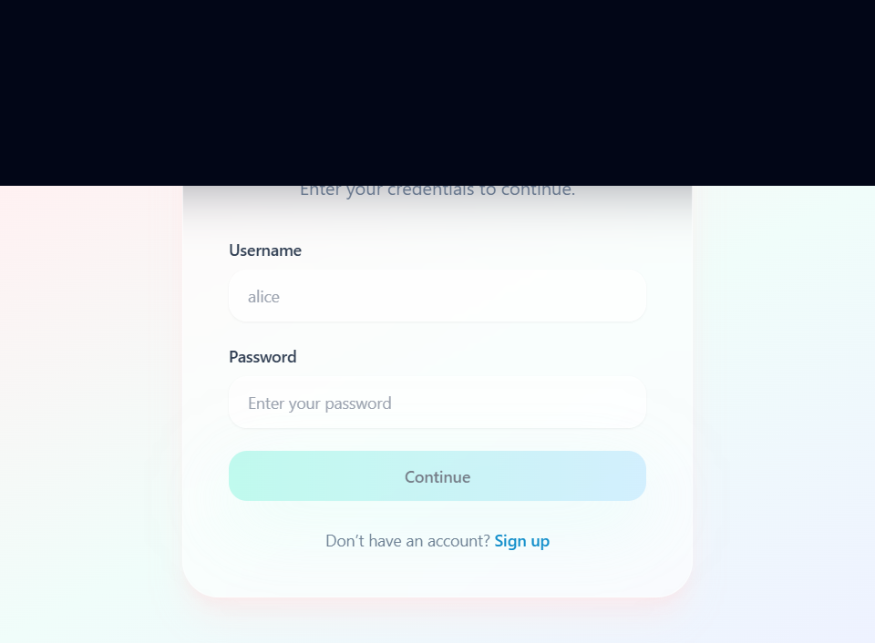
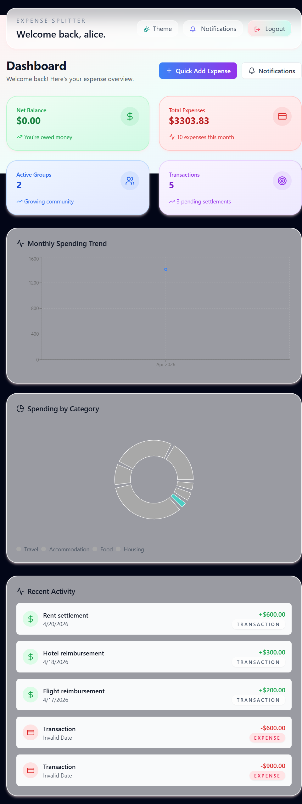
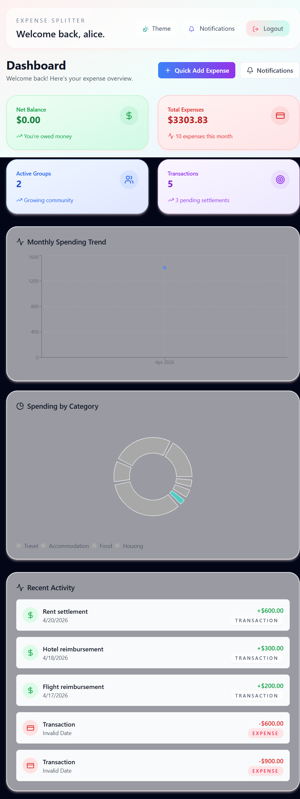
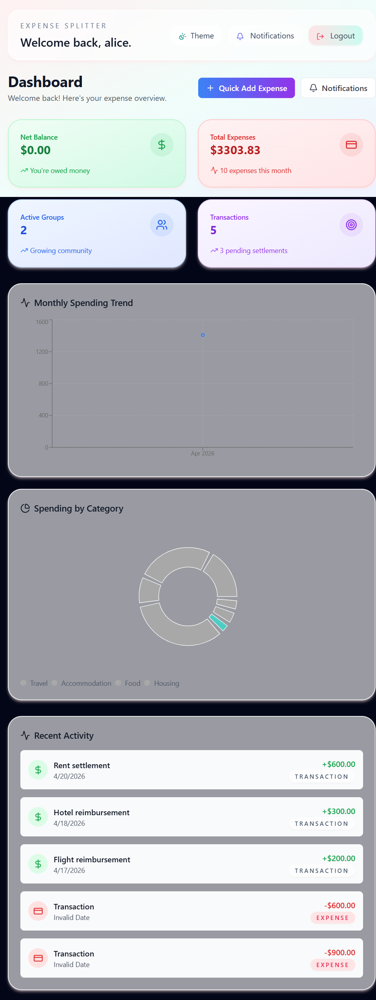

# Expense Splitter

Expense Splitter is a full-stack web application for tracking shared expenses, managing groups, and settling balances between users.

The project uses:
- Backend: Spring Boot, Spring Data JPA, Spring Security, JWT authentication, H2/MySQL database
- Frontend: React, TypeScript, Vite, Tailwind CSS, Axios, Recharts, Framer Motion

## Project overview

The app helps users:
- sign up and log in securely with email/password
- create groups and add group members
- add expenses and split costs across users
- view expense history and transaction details
- see balance summaries and debt settlement status
- generate basic reports for spending and balances

## Architecture

- `backend/` contains the Spring Boot REST API.
  - Data layer: JPA entities, repositories, and a relational database.
  - Security: JWT token authentication with Spring Security.
  - Business logic: services for users, groups, expenses, transactions, and balances.
  - Controllers: REST endpoints for authentication, users, groups, expenses, transactions, and balances.

- `frontend/` contains the React single-page application.
  - Routing: React Router handles authenticated pages and public auth pages.
  - UI: Tailwind CSS for styling, reusable components for forms, cards, modals, and navigation.
  - API: Axios client connects to the backend and sends authorized requests.
  - Charts: Recharts visualizes spending and balance data.

## Features

- User registration and login
- JWT-based auth with protected backend routes
- Group creation and member management
- Expense creation with split details
- Transaction history and detailed expense view
- Balance summaries and debt insights
- Frontend pages for Dashboard, Groups, Expenses, Balances, Transactions, Reports, Login, Signup

## Setup

### Prerequisites

- Node.js and npm
- Java 17
- Maven
- Optional: MySQL if you want to use a persistent external database

### Install dependencies

From the project root:

```bash
npm install
```

Then install frontend dependencies:

```bash
cd frontend
npm install
```

## Run the app

From the project root, start backend and frontend together:

```bash
npm start
```

Alternatively, start services individually:

```bash
npm run start:backend
npm run start:frontend
```

The app runs on:
- Backend: http://localhost:8080
- Frontend: http://localhost:5173

## Database configuration

By default, the backend uses an H2 database stored in `backend/data/expensesdb`.

If you want to use MySQL instead, configure these environment variables before running the backend:

```bash
set MYSQL_URL=jdbc:mysql://localhost:3306/expenses?useSSL=false&allowPublicKeyRetrieval=true&serverTimezone=UTC
set MYSQL_USER=root
set MYSQL_PASSWORD=your-password
```

If no environment variables are set, the app will continue using the embedded H2 database.

## Twilio SMS setup

To enable real SMS reminders, configure Twilio credentials for the backend before starting the server:

```bash
set TWILIO_ACCOUNT_SID=your_account_sid
set TWILIO_AUTH_TOKEN=your_auth_token
set TWILIO_FROM_PHONE_NUMBER=+1234567890
```

The backend reads these values from `application.properties` as:

```properties
twilio.account-sid=${TWILIO_ACCOUNT_SID:}
twilio.auth-token=${TWILIO_AUTH_TOKEN:}
twilio.from-phone-number=${TWILIO_FROM_PHONE_NUMBER:}
```

When configured, the notification service sends real SMS reminders through Twilio instead of only logging them.

### Live SMS test endpoint

After starting the backend with Twilio environment variables set, you can verify live SMS by calling:

```bash
curl -X POST http://localhost:8080/api/notifications/test-sms \
  -H "Content-Type: application/json" \
  -H "Authorization: Bearer <JWT_TOKEN>" \
  -d '{"phoneNumber":"+1234567890","message":"This is a live test SMS from Expense Splitter."}'
```

If you want to test the reminder workflow instead, call:

```bash
curl -X POST http://localhost:8080/api/notifications/reminders \
  -H "Authorization: Bearer <JWT_TOKEN>"
```

## Authentication

The app supports signup and login.

Seeded sample accounts are available for testing:

- `alice@example.com` / `password123`
- `ben@example.com` / `password123`
- `clara@example.com` / `password123`

## Folder structure

- `backend/`
  - `src/main/java/com/example/expensesplitter/`
    - `config/` - application configuration and data seeding
    - `controller/` - REST API controllers
    - `dto/` - request and response DTOs
    - `entity/` - JPA entity classes
    - `exception/` - custom exception handling
    - `model/` - domain models and security payloads
    - `repository/` - Spring Data JPA repositories
    - `security/` - authentication and JWT configuration
    - `service/` - service layer business logic
  - `src/main/resources/` - application properties, SQL seed data

- `frontend/`
  - `src/` - React app source code
  - `src/components/` - reusable UI components
  - `src/lib/` - API client, auth utilities, shared types
  - `src/pages/` - routed views and page screens

## Screenshots

### Login



### Signup


### Dashboard



### Groups and member management



### Balances



## Notes

- Frontend and backend are decoupled, so the frontend can be deployed independently once the API base URL is configured.
- The backend supports secure JWT authorization for protected routes.
- The current default setup is ready to run locally with minimal configuration.

## License

This repository is provided as-is for learning and development purposes.
